

  
  <h1>AgriScan AI (Zr3 M3ana)</h1>
  
<b>Smart Farming Assistant powered by Vision AI & Large Language Models</b>

  

  
  
  
  
  

<h2>About The Project</h2>

Modern agriculture faces growing challenges with the rapid spread of plant pathologies. Late detection leads to significant crop losses and the overuse of chemical treatments. <b>AgriScan AI (Zr3 M3ana)</b> is a mobile-first solution built specifically for farmers (with native Moroccan Arabic support) to diagnose plant diseases instantly using smartphone cameras and state-of-the-art AI.

<h3>Key Features</h3>
<ul>
  <li><b>AgriScan (Vision AI):</b> Crop a photo of a sick leaf and instantly receive the plant name, disease condition, confidence score, and step-by-step treatment plans powered by Llama-4-Scout.</li>
  <li><b>AgriBot:</b> A contextual, multilingual virtual assistant (Llama-3.3-Versatile). It automatically knows what plant you just scanned and can chat with you in English, French, or Arabic.</li>
  <li><b>PlantWiki:</b> A built-in global plant database to search for crop requirements (watering, sunlight, soil) and save favorites.</li>
  <li><b>Dynamic Accessibility:</b> Native RTL (Right-to-Left) support for Arabic users, alongside a customizable Dark Mode.</li>
  <li><b>Smart Dashboard:</b> Real-time localized weather data and quick access to recent scans.</li>
</ul>

<h2>App Preview</h2>

<h3 align="center">1. Authentication & Secure Access</h3>
<table align="center" width="100%">
  <tr>
    <td align="center" width="50%">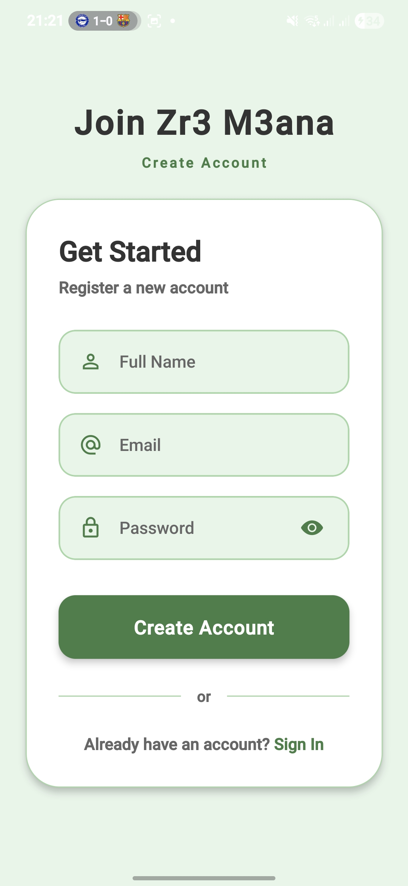</td>
    <td align="center" width="50%">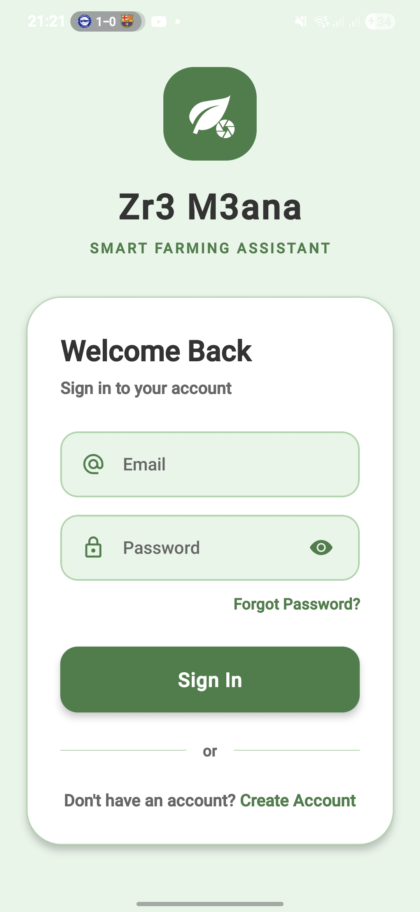</td>
  </tr>
  <tr>
    <td align="center"><i>Registration interface allowing new users to create a secure account by providing their basic information.</i></td>
    <td align="center"><i>The login screen for farmers who already have an existing account.</i></td>
  </tr>
</table>

 

<h3 align="center">2. Farmer Dashboard</h3>
<table align="center" width="100%">
  <tr>
    <td align="center" width="50%">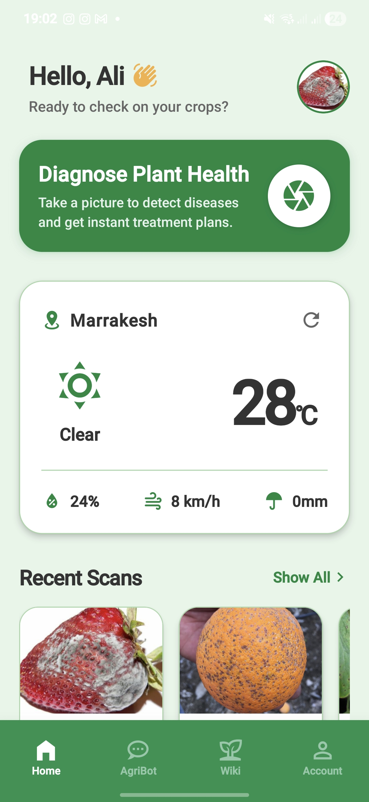</td>
    <td align="center" width="50%">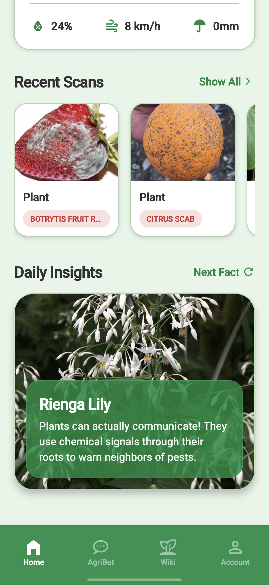</td>
  </tr>
  <tr>
    <td align="center"><i>Top of the home page showing real-time local weather and the main button to start a plant diagnosis.</i></td>
    <td align="center"><i>Bottom of the home page showing recent scans and a card with daily plant insights.</i></td>
  </tr>
</table>

 

<h3 align="center">3. Conversational Virtual Assistant (AgriBot)</h3>
<table align="center" width="100%">
  <tr>
    <td align="center" width="50%">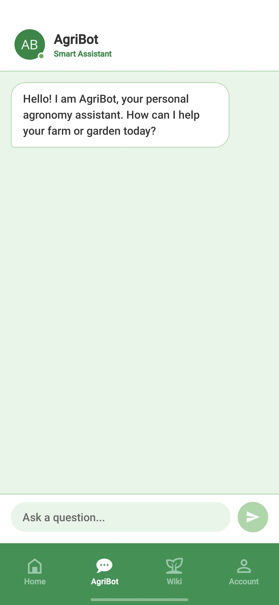</td>
    <td align="center" width="50%">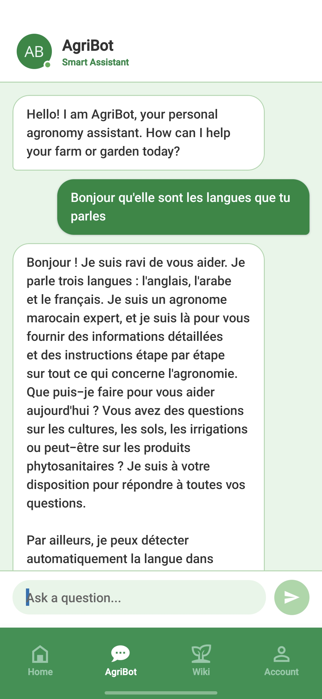</td>
  </tr>
  <tr>
    <td align="center"><i>AgriBot start screen showing the welcome message, ready to assist the user.</i></td>
    <td align="center"><i>Active conversation demonstrating the assistant understanding and replying perfectly in multiple languages.</i></td>
  </tr>
</table>

 

<h3 align="center">4. Agronomic Library & Tracking</h3>
<table align="center" width="100%">
  <tr>
    <td align="center" width="50%">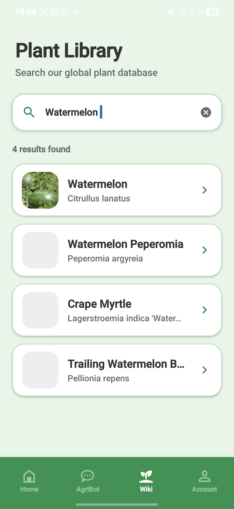</td>
    <td align="center" width="50%">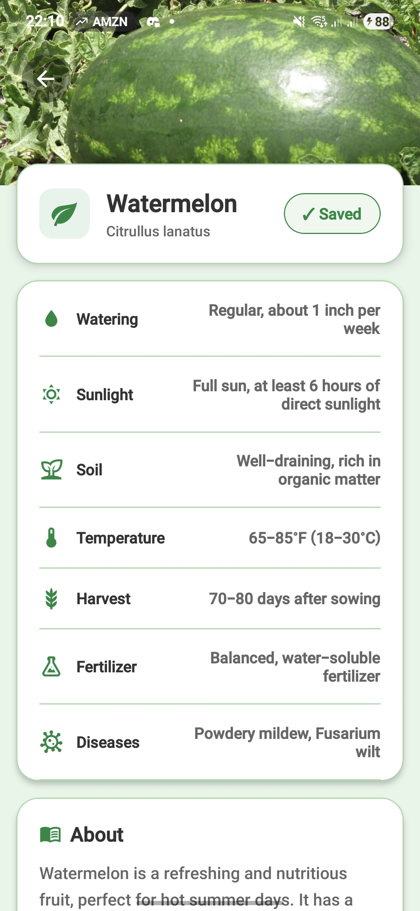</td>
  </tr>
  <tr>
    <td align="center"><i>Library search screen showing species matching the user's query (e.g., Watermelon).</i></td>
    <td align="center"><i>Detailed plant card showing practical information and a button to save it to favorites.</i></td>
  </tr>
</table>

 

<h3 align="center">5. Personal Space & History</h3>
<table align="center" width="100%">
  <tr>
    <td align="center" width="50%">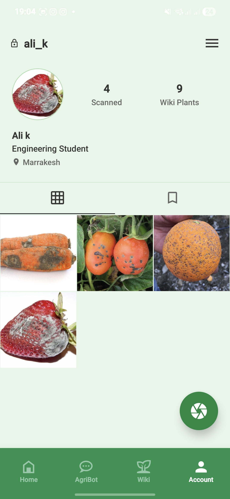</td>
    <td align="center" width="50%">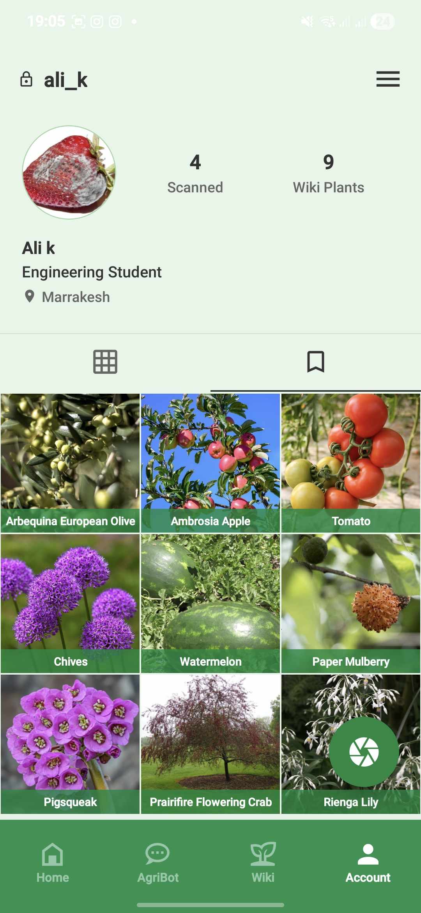</td>
  </tr>
  <tr>
    <td align="center"><i>First tab of the profile displaying a grid of all diseased plant photos the farmer has scanned and saved.</i></td>
    <td align="center"><i>Second tab of the profile displaying the user's saved dictionary items from the PlantWiki.</i></td>
  </tr>
</table>

 

<h3 align="center">6. Settings & Customization</h3>
<table align="center" width="100%">
  <tr>
    <td align="center" width="50%">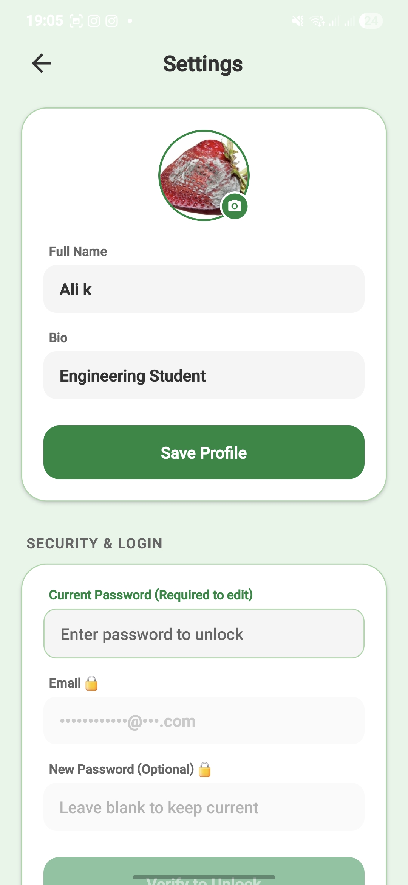</td>
    <td align="center" width="50%">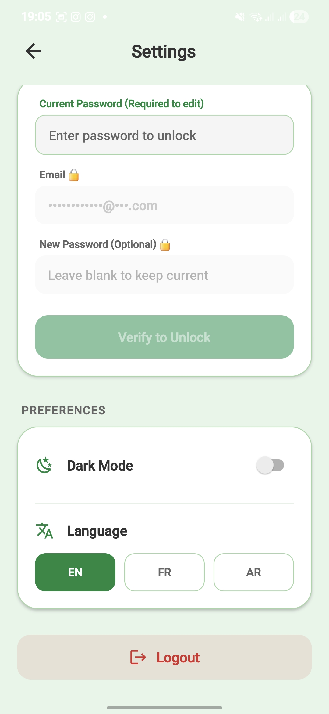</td>
  </tr>
  <tr>
    <td align="center"><i>Top of the settings page allowing the user to easily customize their profile, photo, full name, and bio.</i></td>
    <td align="center"><i>Security section requiring the current password for updates, alongside language and dark mode options.</i></td>
  </tr>
</table>

 

<h3 align="center">7. AI Phytosanitary Diagnostic Process</h3>
<table align="center" width="100%">
  <tr>
    <td align="center" width="50%">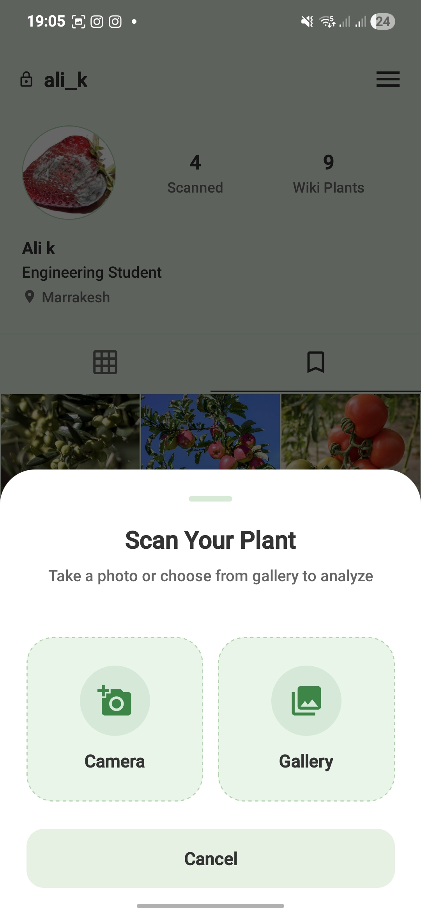</td>
    <td align="center" width="50%">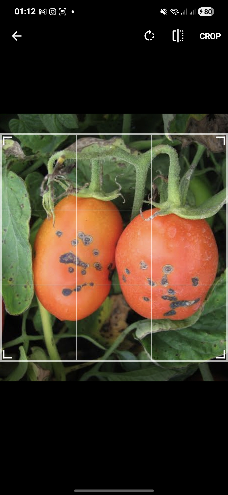</td>
  </tr>
  <tr>
    <td align="center"><i>Scan menu giving the user the choice to take a live photo with the camera or import one from the gallery.</i></td>
    <td align="center"><i>Cropping tool to isolate the infected area of the plant, preparing the image to ensure accurate AI analysis.</i></td>
  </tr>
</table>

 

<h3 align="center">8. Analysis Results & Treatment Plan</h3>
<table align="center" width="100%">
  <tr>
    <td align="center" width="50%">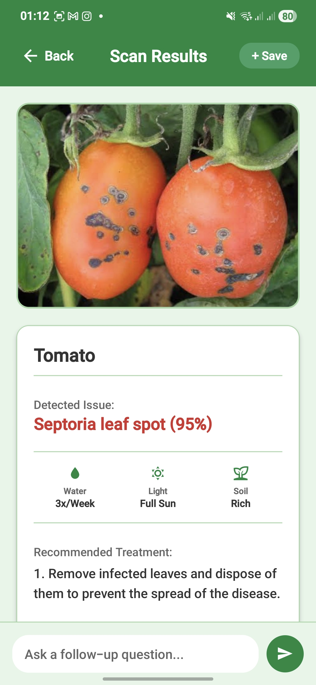</td>
    <td align="center" width="50%">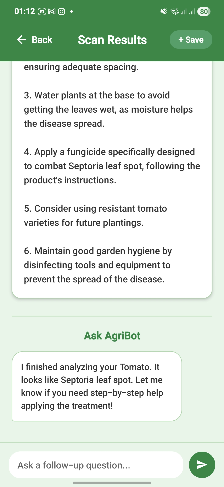</td>
  </tr>
  <tr>
    <td align="center"><i>Top of the results page where the AI identifies the disease with 95% certainty and recalls basic plant needs.</i></td>
    <td align="center"><i>Bottom of the results listing precise treatment actions and a space to ask follow-up questions directly to AgriBot.</i></td>
  </tr>
</table>

<h2>Architecture & Tech Stack</h2>

AgriScan uses a strictly decoupled Client-Server architecture to separate the user interface from the heavy AI inference logic.

<b>Click to expand Tech Stack details</b>

 
<b>Frontend (Mobile App)</b>
<ul>
  <li><b>Framework:</b> React Native (Expo)</li>
  <li><b>Routing:</b> Expo Router</li>
  <li><b>UI/UX Handling:</b> Dynamic RTL switching, robust Regex parsing to clean AI JSON responses.</li>
</ul>

<b>Backend (REST API)</b>
<ul>
  <li><b>Framework:</b> FastAPI (Python) - Chosen for asynchronous speed.</li>
  <li><b>Image Processing:</b> PIL (Python Imaging Library) for resizing and Base64 encoding.</li>
  <li><b>Database:</b> SQLite with SQLAlchemy ORM (Tables: User, ScanHistory, PlantWiki, UserSavedPlant, ChatMessage).</li>
</ul>

<b>Artificial Intelligence</b>
<ul>
  <li><b>Provider:</b> Groq API (Ultra-fast inference)</li>
  <li><b>Vision Model:</b> Llama-4-Scout (Disease detection and confidence scoring)</li>
  <li><b>LLM Model:</b> Llama-3.3-Versatile (AgriBot conversational engine)</li>
</ul>

<h2>Getting Started (Local Installation)</h2>

To run AgriScan AI on your local machine, you will need to run the backend and frontend simultaneously. Since the mobile app needs to communicate with your computer, ensure both your computer and testing phone are on the same Wi-Fi network.

<blockquote>
  <b>Prerequisites:</b> You must have Python 3.8+, Node.js, npm, and the Expo Go mobile app installed before proceeding.
</blockquote>

<b>Phase 1: Backend Setup (FastAPI)</b>

 

1. Open your terminal and navigate to the backend folder:

<pre><code>cd Zr3M3ana-bd</code></pre>

2. Create and activate a Python virtual environment:

<pre><code>python -m venv venv
.\venv\Scripts\activate</code></pre>

3. Install all required Python libraries:

<pre><code>pip install fastapi uvicorn sqlalchemy groq pydantic pillow</code></pre>

4. <b>Configure API Keys:</b> Open <code>Zr3M3ana-bd/config.py</code> in your code editor. Locate the API key variables at the top of the file and replace the placeholder strings with your actual keys:

<pre><code>GROQ_API_KEY = "your_real_groq_key_here"
PERENUAL_TOKEN = "your_real_perenual_token_here"</code></pre>

5. <b>Start the Server:</b> Run the server using <code>0.0.0.0</code> so your mobile phone can access it over your local network:

<pre><code>uvicorn main:app --host 0.0.0.0 --port 8000 --reload</code></pre>

 

<b>Phase 2: Frontend Setup (React Native / Expo)</b>

 

1. Open a <i>second</i> terminal window and navigate to the frontend folder:

<pre><code>cd Zr3M3ana</code></pre>

2. Install the required Node dependencies:

<pre><code>npm install</code></pre>

3. <b>Configure the Network IP Address:</b> Find your computer's local IPv4 address by typing <kbd>ipconfig</kbd> in a Windows terminal (it usually looks like <code>192.168.1.X</code>).

<ul>
  <li>Open <code>Zr3M3ana/api.js</code> and replace the localhost URL with your local IP address (e.g., <code>http://192.168.1.X:8000</code>).</li>
  <li>Open <code>Zr3M3ana/app/(tabs)/index.tsx</code> and update the IP address there to match.</li>
</ul>

4. <b>Start the App:</b>

<pre><code>npx expo start</code></pre>

 

<b>Phase 3: Running on your Phone</b>

 

Once the Expo server is running, a QR code will appear in your frontend terminal window. Scan this QR code with the <b>Expo Go</b> app on your physical smartphone. You can now test the camera, database, and AI scanning features live on your device.

  
Built by Ali Kadaoui at EMSI Marrakesh

